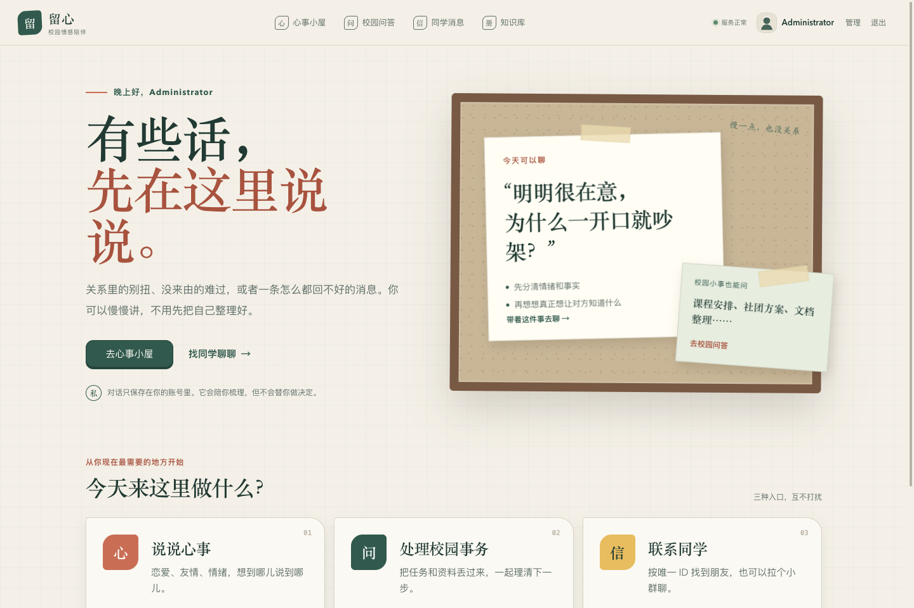
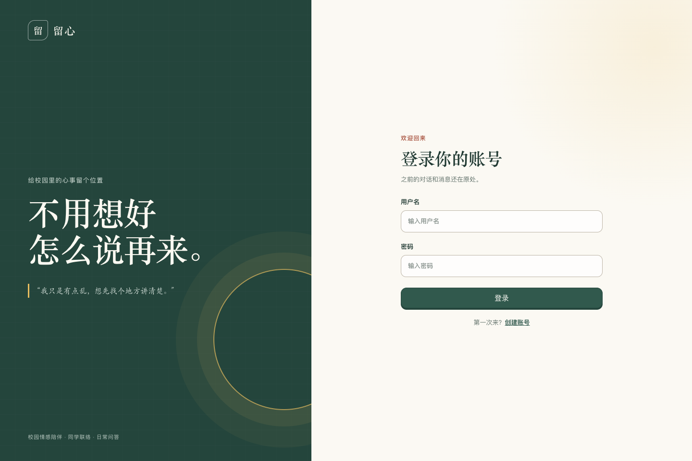
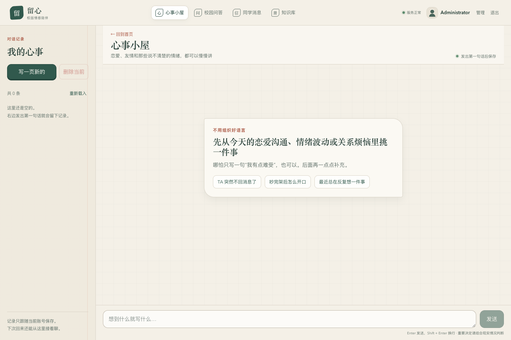
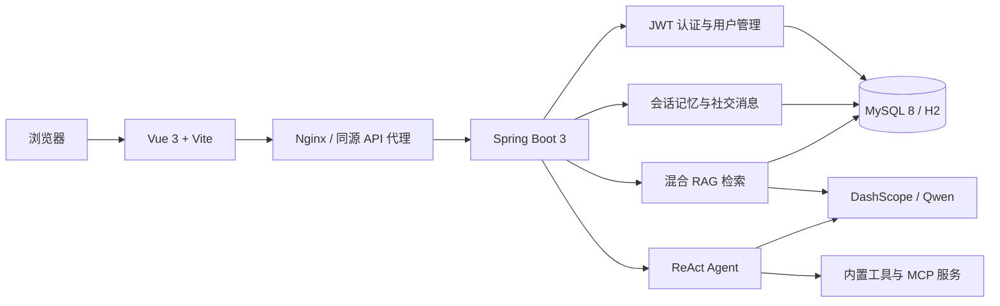

# 留心 · 校园情感陪伴 AI

一个面向校园场景的全栈 AI 应用：既能陪你梳理关系与情绪，也能处理校园事务，还支持同学之间的私聊与群聊。

`Vue 3` · `Spring Boot 3` · `Spring AI Alibaba` · `RAG` ·
`ReAct Agent` · `MySQL` · `Docker`



## 项目简介

留心不只是一个聊天页面。项目把情感陪伴、智能体工具调用、长期会话记忆、知识库检索、用户体系和校园社交整合在同一套应用中，并通过 SSE 实时返回 AI 内容。

项目包含三个主要入口：

- **心事小屋**：围绕恋爱、友情和情绪提供连续对话，结合校园情感知识库给出更贴合场景的回答。
- **校园问答**：基于 ReAct 模式的智能体，可按需调用搜索、网页读取、文件生成等工具完成任务。
- **同学消息**：通过唯一用户 ID 添加好友，支持单聊、群聊、未读消息和成员邀请。

> 留心提供的是辅助梳理与信息支持，不能替代心理咨询、医疗建议或现实中的紧急援助。

## 界面预览

| 登录与账号 | 心事小屋 |
| --- | --- |
|  |  |

## 核心能力

### AI 对话与智能体

- 对接阿里云百炼 DashScope / 通义千问模型。
- 通过 SSE 流式输出 `ack → delta → done` 事件，前端逐字呈现回答。
- 使用 ReAct 执行框架组织思考与工具调用，并隔离工具结果和最终回复。
- 完整配置支持网页搜索、网页读取、Markdown / PDF 生成、资源下载等工具；
  对外演示配置默认只保留网页搜索、Markdown 生成和终止工具。
- 内置独立 MCP 图片搜索服务，支持 stdio 与 SSE 两种连接方式。

### RAG 与长期记忆

- 情感知识库采用向量召回与 BM25 关键词召回，通过 RRF 融合排序。
- 查询增强会结合对话上下文补全用户意图，并过滤弱相关候选。
- 向量服务异常时自动降级为本地关键词检索，避免整个问答链路中断。
- 会话、消息、滚动摘要和显式用户事实持久化保存，并按 token 预算组装上下文。
- 管理员可在网页中上传、编辑、删除知识文档，更新后同步刷新检索索引。

### 账号、社交与安全

- JWT 无状态认证，支持注册开关、个人资料、头像与管理员用户管理。
- 通过公开用户 ID 建立好友关系，支持单聊、群聊、未读计数和消息轮询。
- 会话、生成文件和用户记忆均校验账号归属，避免跨用户访问。
- 提供 AI 请求频率限制、会话保留策略和敏感日志开关。
- 演示环境默认关闭终端执行、任意文件读写、网页抓取等高风险工具。

## 技术架构



| 层级 | 技术 |
| --- | --- |
| 前端 | Vue 3、TypeScript、Vite、Vue Router、Axios、markdown-it |
| 后端 | Java 21、Spring Boot 3.4.8、Spring Security、Spring Data JPA |
| AI | Spring AI Alibaba、DashScope SDK、LangChain4j、ReAct、MCP |
| 数据 | MySQL 8、Flyway；H2 用于演示环境、测试与存量迁移 |
| 部署 | Docker、Docker Compose、Nginx |

## 快速开始

### 方式一：Docker 一键启动演示环境

适合本机体验。演示环境使用 H2 文件数据库，只向 `127.0.0.1:8080` 暴露入口，数据保存在 Docker Volume 中。

准备环境：

- Docker 与 Docker Compose
- 一个有效的 [阿里云百炼 DashScope API Key](https://bailian.console.aliyun.com/)

```bash
git clone https://github.com/Lyh2422/liu-ai-agent.git
cd liu-ai-agent

cp .env.demo.example .env.demo
openssl rand -hex 32
```

编辑 `.env.demo`，至少替换以下配置：

```dotenv
DASHSCOPE_API_KEY=你的-DashScope-Key
AUTH_JWT_SECRET=上一步生成的随机值
AUTH_BOOTSTRAP_ADMIN_USERNAME=admin
AUTH_BOOTSTRAP_ADMIN_PASSWORD=请设置强密码
```

启动并验证：

```bash
docker compose -f compose.demo.yml up -d --build
```

可通过日志确认后端已启动；该命令会持续跟踪日志，按 `Ctrl+C` 退出不会停止容器：

```bash
docker compose -f compose.demo.yml logs -f backend
```

另开一个终端验证健康状态：

```bash
curl http://localhost:8080/api/health
```

接口返回 `ok` 后，访问 [http://localhost:8080](http://localhost:8080)。

```bash
# 停止服务但保留数据
docker compose -f compose.demo.yml down
```

> 不要把 `.env.demo` 提交到 Git。除非确认要清空全部演示数据，
> 否则不要执行 `docker compose -f compose.demo.yml down -v`。

### 方式二：本地开发

准备 Java 21、Node.js 20+、MySQL 8。仓库已包含 Maven Wrapper，
无需单独安装 Maven。先启动数据库：

```bash
cp .env.mysql.example .env.mysql
docker compose --env-file .env.mysql -f compose.mysql.yml up -d
```

将同一份数据库配置和后端所需密钥载入当前终端，再启动 Spring Boot：

```bash
set -a
source .env.mysql
set +a

export CHAT_DATABASE_URL="jdbc:mysql://127.0.0.1:${MYSQL_PORT:-3306}/liu_ai_agent?useUnicode=true&characterEncoding=utf8&serverTimezone=UTC&useSSL=false&allowPublicKeyRetrieval=true"
export DASHSCOPE_API_KEY='你的-DashScope-Key'
export AUTH_JWT_SECRET="$(openssl rand -hex 32)"
export AUTH_BOOTSTRAP_ADMIN_PASSWORD='请设置强密码'

./mvnw spring-boot:run
```

另开一个终端启动前端：

```bash
cd liu-ai-agent-frontend
npm ci
npm run dev
```

以上命令使用 Bash / zsh 语法。Windows 可在 WSL 或 Git Bash 中执行，
也可以在 PowerShell 中设置同名环境变量。

开发地址：

- 前端：[http://localhost:5173](http://localhost:5173)
- 后端健康检查：[http://localhost:8123/api/health](http://localhost:8123/api/health)
- Swagger UI：[http://localhost:8123/api/swagger-ui.html](http://localhost:8123/api/swagger-ui.html)

## 环境变量

| 变量 | 必填 | 说明 |
| --- | --- | --- |
| `DASHSCOPE_API_KEY` | 是 | DashScope 模型访问密钥 |
| `DASHSCOPE_CHAT_MODEL` | 否 | 聊天模型，默认 `qwen3.7-flash` |
| `DASHSCOPE_CHAT_MULTI_MODEL` | 否 | 是否使用多模态协议，默认 `true` |
| `SEARCH_API_KEY` | 否 | 联网搜索服务密钥；留空时搜索工具不可用 |
| `AUTH_JWT_SECRET` | 是 | JWT 签名密钥，建议使用 `openssl rand -hex 32` 生成 |
| `AUTH_BOOTSTRAP_ADMIN_USERNAME` | 演示必填 | 首次启动时创建的管理员用户名；示例已提供 `admin` |
| `AUTH_BOOTSTRAP_ADMIN_PASSWORD` | 是 | 首次启动时创建的管理员密码 |
| `AUTH_REGISTRATION_ENABLED` | 否 | 是否开放注册；生产环境建议关闭 |
| `CHAT_DATABASE_URL` | 按需 | MySQL JDBC 地址；生产 Compose 已自动注入 |
| `CHAT_DATABASE_USERNAME` | 生产建议配置 | 数据库用户名，Compose 默认 `liu_ai_agent` |
| `CHAT_DATABASE_PASSWORD` | 生产 Compose 必填 | 应用数据库密码 |
| `MYSQL_ROOT_PASSWORD` | 生产 Compose 必填 | MySQL root 密码，应与应用密码不同 |
| `AI_REQUESTS_PER_MINUTE` | 否 | 每位登录用户每分钟的 AI 请求上限 |
| `AI_SENSITIVE_LOGGING_ENABLED` | 否 | 是否记录敏感 AI 内容，默认 `false` |
| `CHAT_RETENTION_DAYS` | 否 | 会话自动保留天数 |
| `AGENT_TOOLS_DANGEROUS_ENABLED` | 否 | 是否注册文件、终端、抓取等高风险工具；公开部署建议设为 `false` |

完整示例见 [`.env.demo.example`](.env.demo.example)、
[`.env.prod.example`](.env.prod.example) 和
[`.env.mysql.example`](.env.mysql.example)。

## 项目结构

```text
liu-ai-agent/
├── src/main/java/com/lyh/liuaiagent/
│   ├── agent/          # ReAct / ToolCall Agent 执行框架
│   ├── app/            # 情感陪伴应用
│   ├── auth/           # 认证、资料与管理员能力
│   ├── conversation/   # 会话持久化、摘要与长期记忆
│   ├── knowledge/      # 知识库管理
│   ├── rag/            # 混合检索与查询增强
│   ├── social/         # 好友、单聊与群聊
│   └── tools/          # Agent 工具集合
├── src/main/resources/
│   ├── db/migration/   # Flyway 数据库迁移
│   ├── document/       # 内置校园情感知识文档
│   └── rag/            # 查询扩展配置
├── liu-ai-agent-frontend/       # Vue 3 前端
├── liu-image-search-mcp-server/ # 图片搜索 MCP 服务
├── docs/                        # 设计、部署与运维文档
└── compose.*.yml                # 演示、MySQL 与生产编排
```

## 构建与测试

```bash
# 后端编译打包
./mvnw -DskipTests package

# 运行测试（涉及真实模型的集成场景需要有效 API Key）
./mvnw test

# 前端生产构建
cd liu-ai-agent-frontend
npm ci
VITE_API_BASE_URL=/api npm run build
```

## 部署

生产环境使用 MySQL、Flyway 和独立前后端容器：

```bash
cp .env.prod.example .env.prod
# 替换 .env.prod 中所有 replace-with-* 配置
docker compose --env-file .env.prod -f compose.prod.yml up -d --build
```

更详细的说明：

- [朋友内测部署](docs/demo-deployment.md)
- [H2 迁移到 MySQL](docs/mysql-migration.md)
- [会话历史与长期记忆](docs/conversation-history.md)
- [混合检索设计](docs/hybrid-retrieval.md)
- [知识库管理](docs/knowledge-management.md)
- [SSE 响应缓存](docs/sse-response-cache.md)

## 安全说明

- 仓库只提供 `.env.*.example` 模板，真实 `.env.demo`、`.env.prod`、
  `.env.mysql` 和 `application-local.yml` 已被忽略。
- 请勿在代码、提交记录、Issue、日志或截图中粘贴 API Key、JWT 密钥和数据库密码。
- 公网部署前请关闭开放注册、设置强密码，并根据实际流量调整请求频率限制。
- `compose.demo.yml` 默认关闭高风险 Agent 工具和接口文档；完整生产配置默认会注册全部工具，
  公开部署前建议设置 `AGENT_TOOLS_DANGEROUS_ENABLED=false`。
- 演示配置只监听本机回环地址；需要邀请他人体验时，请参考
  [朋友内测部署](docs/demo-deployment.md) 使用受控反向代理或临时隧道，
  不要直接改成全网卡裸露端口。
- 如果密钥曾被提交，即使后来删除文件，也应立即在服务商控制台轮换密钥并清理 Git 历史。

---

如果这个项目对你有帮助，欢迎提交 Issue 或 Pull Request，
一起把校园里的 AI 陪伴做得更可靠、更克制。
