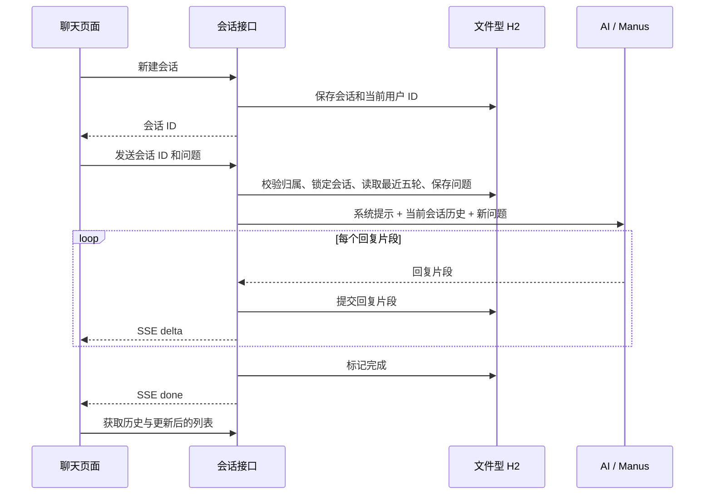

# 历史对话与会话记忆

两个入口（AI 情感陪伴、AI 智能问答）都支持新建会话、切换历史、刷新恢复，以及后端重启后继续对话。

## 第一层：像给每个话题准备一本笔记本

例如你在会话 A 说“我叫小林，周五想表白”，在会话 B 聊学习计划。切回 A 后，页面会找回 A 的对话；你问“我叫什么”，后端会把 A 最近的对话和这个问题一起交给 AI。B 的学习计划不会混进来。

- 会话 ID 是笔记本编号，由服务端生成。
- 会话列表是目录，记录所属账号、应用类型、标题和更新时间。
- 数据库是保存笔记的地方；关闭浏览器或重启 Java 进程不会清空它。
- AI 的“记忆”来自请求中附带的历史消息，不是模型自己记住了账号。

## 第二层：数据结构和请求流程

复用项目已有的 Spring Data JPA 和文件型 H2，不新增数据库服务或依赖。

| 数据表 | 保存内容 | 作用 |
| --- | --- | --- |
| `chat_conversations` | UUID、userId、LOVE/MANUS、标题、创建和更新时间 | 按用户和应用查找会话 |
| `chat_turns` | 会话外键、问题、回复、状态、创建时间 | 一条记录代表一轮问答，保证用户问题和 AI 回复成对关联 |



`ConversationStore.begin()` 在短事务里锁定会话行：验证 `userId` 和 `appType`，阻止同一会话同时生成两轮，读取历史，保存新问题及 `STREAMING` 回复占位，并以第一条问题自动命名会话。模型调用发生在事务外，不会在模型生成期间一直占用数据库事务。

`ConversationChatService` 协调模型和持久化。先提交回复片段，再发送 `delta` 事件。完成时记录 `COMPLETED`；异常记录 `FAILED`；断开连接或取消记录 `INTERRUPTED`。单实例应用启动时，把上次进程遗留的 `STREAMING` 记录标为 `INTERRUPTED`，保留已经写入的文字，让用户可以继续发送消息。

`LoveApp.chatWithHistory()` 使用单独的 ChatClient，显式添加历史消息。该链路不再让文件记忆 Advisor 重复写入，也不走全局热问题回答缓存，避免绕过会话上下文或把个性化回答跨用户复用。旧演示方法仍保留。

Manus 每次请求仍创建独立 Agent，先注入当前会话最近的完整问答，再运行步骤。跨请求恢复的是用户可见的对话；工具调用状态和正在执行的外部操作不会自动恢复。无需调用工具时，会显示模型实际回答并结束本轮；工具或模型异常会进入失败流程。

## 接口

以下路径相对于 `/api`，均需要 `Authorization: Bearer <token>`。

| 方法与路径 | 参数 | 返回 |
| --- | --- | --- |
| `POST /ai/conversations` | `{"appType":"LOVE"}` 或 `MANUS` | 新会话 |
| `GET /ai/conversations?appType=LOVE` | 应用类型 | 当前用户的会话，按更新时间倒序 |
| `GET /ai/conversations/{id}` | 会话 ID | 会话信息、按顺序展开的用户和助手消息 |
| `POST /ai/love_app/chat/sse` | `{"chatId":"...","message":"..."}` | `ack` / `delta` / `done` / `error` SSE |
| `POST /ai/manus/chat` | 同上 | 同上 |

JWT 过滤器也处理 SSE 完成时的异步分派，确保无状态认证在该阶段仍有效。

新页面用 POST 发送消息。原 GET 聊天路由保留，但必须传入服务端为当前用户创建的会话 ID；旧客户端任意生成 chatId 的方式不再被接受。不存在、属于其他用户或类型不符的会话返回 404；正在回复的会话再次发送返回 409；空消息与超过 10000 字符的消息返回 400。

## 前端实现

`ConversationChat.vue` 是两个应用共用的会话容器，负责历史列表、新建、切换、消息流和错误状态。`ChatWindow.vue` 负责消息展示与输入，两个页面只传入应用类型和展示文案。

- URL 的 `?chat=<id>` 记录当前会话；刷新后优先打开它，否则打开最近会话。
- 首次发送会自动创建会话，也可以点击“新建会话”。
- 本页生成过程中暂时禁用新建、切换和重复发送，防止异步回复写进其他会话窗口。
- 离开页面会取消 fetch；再次进入从后端恢复。其他标签页仍在生成的会话会定时刷新。
- 手机端历史会话横向排列；桌面端使用左侧历史列表。
- 浏览器只保留已有登录信息和当前会话 URL；聊天内容以服务端数据库为准。

## 重启与部署

默认本地配置使用 `./tmp/data/liu-ai-agent-local.mv.db`；基础/生产配置默认使用 `./tmp/data/liu-ai-agent.mv.db`。已有 `ddl-auto: update` 会自动创建两张新表。

两份数据源配置都支持通过 `CHAT_DATABASE_URL` 指定固定位置，例如：

```sh
export CHAT_DATABASE_URL='jdbc:h2:file:/absolute/data/liu-ai-agent;MODE=MySQL;AUTO_SERVER=TRUE'
mvn spring-boot:run
```

正常重启使用相同 profile、工作目录和数据库路径即可恢复。切换 local/prod 默认会打开不同数据库；需要共享时显式指定同一个 `CHAT_DATABASE_URL`。

Docker 容器重建需要挂载持久化目录，例如 `-v liu-ai-data:/app/tmp`。这里的保证建立在数据库文件仍然存在的前提下，删除 `tmp`、换磁盘或不挂载数据卷重建容器都会影响数据。数据备份建议停服后复制数据库文件。

当前恢复逻辑适合项目的单实例部署。多实例部署需要改用共享数据库及生成任务租约，不能让每个实例启动时重置其他实例正在生成的状态。

## 边界与常见误解

1. **全部历史保存，不代表全部历史都送给模型。** 当前取最近五轮完整问答（十条历史消息），控制请求长度；更早的记录可以查看，但不会自动加入当前上下文。长期记忆可后续增加会话摘要。
2. **未完成的回复可以查看，但不作为下一轮完整上下文。** 当前请求失败或中断后，用户可重新描述问题并继续；已经持久化的文字仍在历史中。进程突然退出时，尚未从模型收到或尚未提交数据库的内容无法恢复。
3. **重启能恢复文本，不能继续执行先前的工具动作。** Manus 的工具内部状态、正在进行的任务和外部副作用不属于本次持久化范围。
4. **旧 Kryo 文件没有可信的用户归属目录。** 此次没有自动导入旧文件，避免把历史错误分配给账号。新功能上线后创建的会话使用数据库保存。
5. **历史列表和消息目前一次性加载。** 适合当前项目规模；会话量很大时，可继续加入分页和消息分段加载。

## 验证

```sh
mvn -o -Dtest='ConversationPersistenceTest,ConversationControllerTest,LoveHistoryPromptTest,ConversationSecurityStreamTest,AuthServiceTest,HotQuestionCacheServiceTest' test
npm --prefix liu-ai-agent-frontend run build
```

新增 10 项后端测试覆盖：真实 H2 文件关闭再打开、重启中断恢复、账号/应用/会话隔离、最近五轮窗口、并发发送、SSE 先保存后发送、失败与取消、原 GET 路由权限、参数校验，情感聊天和 Manus 实际模型 Prompt 中的历史内容，以及包含 JWT 安全过滤链的 SSE 异步分派。另有 5 项已有登录与缓存测试回归。

`scripts/conversation-ui-smoke.cjs` 使用 Playwright 和模拟 API，验证新建、发送、切换、刷新恢复、两个入口及移动端布局。它不调用真实 AI；模型是否正确回答语义问题还取决于实际模型服务。

```sh
# 先启动前端开发服务，提供本机已有的 Playwright 模块位置
PLAYWRIGHT_MODULE=/path/to/playwright node scripts/conversation-ui-smoke.cjs
```

## 自测：是否理解了实现

- 浏览器清空页面状态后，历史从哪里恢复？
- 为什么数据库保存了七轮，而 AI 请求只包含最近五轮？
- 为什么发送 chatId 后，服务端还必须检查它属于当前登录用户？
