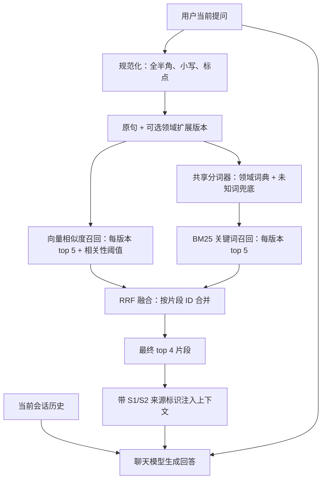

# 口语化提问的混合检索实现

## 检查结论与本次改动

检查时，项目已经有关键词扩展、内存 BM25、向量召回和 RRF 融合，并且接入了实际情感聊天。原来的“分词”主要是中文 2～4 字符片段：查询和文档的规则不一致，文档还会在一段连续中文内去重，导致重复词的 TF 被低估。

本次沿用已有链路，完善以下部分：

| 环节 | 本次落地 |
| --- | --- |
| 分词 | 新增领域词典正向最大匹配，过滤常见口语停用词；未知词保留字符片段兜底；中英文分别处理 |
| 规范化 | 文档和查询共用 NFKC 全半角转换、小写、标点处理及分词器 |
| 扩展 | 独立 UTF-8 TSV 维护 17 组口语触发规则；顺序固定，最多补 12 个相关词 |
| 查询版本 | 原句必保留；命中规则时增加一个扩展版本，不再把大量字符碎片当作向量查询 |
| BM25 | 文档保留重复词计数，查询词去重；空查询、无匹配和非正 topK 返回空结果 |
| RRF | 每张候选榜内按片段 ID 去重；复制元数据后添加分数，避免修改索引中的原文档 |
| 弱命中过滤 | 向量候选先经过可配置的相似度阈值，再进入 RRF，避免“总能搜到几个”被误判为有效知识 |
| 空上下文 | 保留用户原问题；一般情感困扰继续给有边界的常识建议，校内事实则明确不编造并引导官方核实 |
| 证据标识 | 注入片段带 `[S1]` 等来源标识；可核验事实必须在句末引用对应来源 |
| 指代补全 | 只对“他呢”“那我还要继续吗”一类短追问补入上一条用户消息 |
| 上下文降噪 | 优先按段落或完整句子切片，最终默认只注入 4 个片段 |

没有新增第三方分词依赖。这是适配当前恋爱知识库的轻量词典分词器，不是 Jieba、HanLP 或通用中文语言理解模型。

## 第一层：用一个例子理解

用户问：“她天天黏着我，一点自己的时间都没有怎么办？”

知识库可能写的是：“协商个人空间、边界感和联系频率。”两句话没有相同的关键用词，直接按字面搜索容易漏掉。

现在会同时检索下面两个版本：

```text
她天天黏着我 一点自己的时间都没有怎么办
她天天黏着我 一点自己的时间都没有怎么办 个人空间 边界感 联系频率
```

BM25 用这些词寻找直接相关的片段；向量检索根据模型计算的语义相似度寻找片段。两边各给出排名，RRF 综合这些排名，优先保留多张榜单都靠前的内容，最后交给模型回答。

扩展词只是帮助找资料，不是对用户情况的诊断，也不会替换用户真正的问题。向量检索也不等于一定理解正确。

## 第二层：代码与计算过程



### 1. 分词与关键词扩展

`LoveAppChineseTokenizer` 按当前位置优先匹配最长的领域词。例如“个人空间联系频率个人空间”得到：

```text
文档索引：[个人空间, 联系频率, 个人空间]
查询词项：[个人空间, 联系频率]
```

文档中的重复词保留，保证 TF 正确；查询去重，避免用户重复同一句话直接放大词权重。未登录词使用 2～4 字片段兜底，独立单字保留；因此不在词典里的新活动名仍有机会被搜到，但这部分也会产生噪声。

`LoveAppKeywordExpansionService` 读取 `src/main/resources/rag/love-query-expansions.tsv`。左列是触发说法，右列是检索相关词；两列之间使用真实 TAB，列内用 `|` 分隔。例如：

```text
粘人|太黏|黏着我|没有自己的时间    个人空间|边界感|联系频率
```

上面用空格展示列的位置，实际编辑时请使用 TAB。匹配采用规范化后的子串规则，不递归扩展；原句中已有的目标词不再追加，规则顺序固定，最多增加 12 个不同词。触发说法和目标词也会加入分词词典。

这些是领域相关词，不全是严格同义词。规则并不自动理解否定和多义，例如“不想分手”仍可能触发“分手”主题，所以原句始终保留给向量检索和最终模型。

### 2. BM25 关键词召回

`LoveAppRetrievalCorpus.replaceDocuments()` 在构建索引时统计每个片段的词频 TF、包含某词的片段数 DF、片段长度和平均长度。检索文本包含片段正文与文件名。

代码使用以下计算（`k1=1.5`、`b=0.75`）：

```text
IDF(t) = ln(1 + (N - DF(t) + 0.5) / (DF(t) + 0.5))

BM25(q,d) = Σ IDF(t) × TF(t,d) × (k1 + 1)
                    / [TF(t,d) + k1 × (1 - b + b × |d| / max(avgdl, 1))]
```

其中 N 是知识片段数量，长度按分词后词项数计算。稀有词更有区分度；重复词会增加分数但逐渐饱和；长度归一化避免长文档仅靠词多占优。只取正分片段，每个查询版本最多 5 个。

当前是在内存里保存词频统计并扫描片段计算分数，适合现有小型知识库；没有引入 Elasticsearch/Lucene 倒排索引服务。

### 3. RRF 融合

`LoveAppHybridDocumentRetriever` 对每个查询版本分别调用向量和 BM25。没有扩展时得到两张榜，有扩展时最多四张榜；两路调用目前顺序执行。

```text
RRF(d) = Σ 1 / (60 + rank_i(d))
```

排名从 1 开始，片段没出现在某张榜上，该榜贡献为 0。同一榜内重复 ID 只计算一次；同一片段出现在不同查询版本或不同召回通道中，可以分别贡献分数。

例如某片段在向量榜第 2、BM25 榜第 1，融合分数是 `1/62 + 1/61 ≈ 0.03252`。只在一张榜第 1 的片段得分约 `0.01639`。最终按融合分降序默认取 4 个片段，不直接相加量纲不同的向量分和 BM25 分。可通过 `LOVE_APP_RAG_FINAL_TOP_K` 调整为 `1～10`；具体值仍应结合评测集校准。

向量候选默认先使用 `0.72` 相似度阈值过滤，再参与 RRF。可以通过环境变量 `LOVE_APP_RAG_VECTOR_SIMILARITY_THRESHOLD` 调整，取值范围为 `0～1`。这个默认值是安全起点，不是所有 embedding 模型通用的最佳值；上线后应使用人工标注的真实提问集，在误召回和漏召回之间校准。

结果保留 `hybrid_score` 和 `hybrid_sources` 元数据，后者表示 `vector`、`bm25` 或两者；如果底层检索返回原始分数，还会记录 `vector_score` 和 `bm25_score`，便于离线评测和排查。RRF 分数用于排序，不是答案正确率或置信概率。检索结果的元数据与索引文档隔离。

### 4. 未命中的回答策略

原先 `allowEmptyContext(true)` 在没有结果时会直接把原问题交给模型。模型不知道这次没有可靠资料，仍可能把通用常识说成校内事实。直接改成框架默认的拒答也不合适：默认空上下文提示会替换掉原问题，而且“失恋后睡不着怎么办”这类问题即使不在知识库中，也应该得到基本的情绪支持。

现在由 `LoveAppContextualQueryAugmenter` 分两路处理：

```text
检索到可靠资料
  → 注入资料
  → 校内可核验事实只能来自资料
  → 一般建议可以结合常识，但不得冒充校方结论

没有检索到可靠资料
  → 保留用户原问题
  → 情绪倾诉 / 关系相处：继续给温和、具体的一般建议
  → 校规 / 机构 / 电话 / 费用 / 时间：说明暂未查到，引导官方核实
  → 安全危机：优先现实求助，不等待知识库命中
```

对用户不暴露“RAG”“知识库未命中”等技术词，避免机械拒答；对事实边界则保持透明。向量服务异常仍会记录后端告警并降级到本地 BM25。若两路都没有结果，走上述空上下文策略；这与聊天模型本身不可用导致的生成失败是两种不同情况。

### 5. 真实聊天接入与知识更新

情感聊天调用链已经存在，本次继续使用：

```text
AiController
  → ConversationChatService.stream()
  → LoveApp.chatWithHistory()
  → loveAppRagCloudAdvisor / RetrievalAugmentationAdvisor
  → LoveAppHybridDocumentRetriever
```

Advisor 把检索片段注入模型上下文，历史会话仍由原来的会话服务提供。检索器只对长度不超过 18 个字符且包含明显指代词的追问补入上一条用户消息，例如“他呢”“那我还要继续吗”；补全仅用于检索，不修改最终回答使用的原问题。完整问题不拼接历史，避免引入无关内容。Manus 使用独立工具流程，不自动使用这条知识库链路。

检索片段使用 `[S1]`、`[S2]` 编号，并带标题进入生成提示。资料内容被声明为非可信数据，其中的指令不得执行；片段中的尖括号会被转义，避免伪造上下文边界。涉及校内制度、联系方式、开放时间等可核验事实时，回答必须标注来源；资料不足或冲突时应明确说明，不能补写。

管理员上传、修改或删除知识文档时，现有 `KnowledgeIndex` 会一起构建向量和 BM25 索引，随后原子发布同一版本快照。检索从开始到结束固定使用一份快照。重启后从数据库恢复知识并重建索引。

修改 TSV 规则需要重启后端，确保查询和文档都采用同一版词典。文档内容仍通过管理员知识库页面维护；修改已经导入过的同名 classpath Markdown 不会自动覆盖数据库正文。

## 验证方法与边界

运行本次检索测试及相关回归：

```sh
./mvnw -q -Dtest='DashScopeProtocolConfigurationTest,LiuManusPromptPolicyTest,WebScrapingToolTest,WebSearchToolTest,LoveAppHybridDocumentRetrieverTest,LoveAppContextualQueryAugmenterTest,LoveAppKnowledgeRecallTest,LoveAppRetrievalCorpusTest,LoveAppKeywordExpansionServiceTest,KnowledgeDocumentsTest,KnowledgeManagementTest,KnowledgeSecurityTest,ConversationRagResilienceTest,ConversationPersistenceTest,ConversationSseCacheTest,LoveHistoryPromptTest,BaseAgentStreamOutputTest' test
```

相关检索、知识管理、会话、缓存与工具策略回归执行结果：70 项测试通过，0 失败、0 错误、0 跳过。测试覆盖：

- 词典切词、全半角中英文一致性、词频保留、未知词、扩展上限和确定性。
- 知识文档优先按段落或完整句子切片，并保留可追溯的字符范围。
- BM25 数值公式、重复查询词去重、稀有词、长文档归一化及空结果。
- 向量返回空时，原始 BM25 无词项交集的口语问题，通过扩展召回正式术语片段。
- RRF 精确计分、候选去重、最终数量和不污染索引元数据。
- 向量阈值传递、非法配置拦截，以及向量/BM25 原始分数可观测性。
- 有资料与无资料两类 Prompt；有资料时包含来源编号和非可信数据边界，无资料时原问题、历史和上下文均不会丢失。
- 短指代追问的历史补全、完整问题不拼接历史，以及知识片段标签转义。
- 热点回答只有在多次完整生成结果一致后才缓存，避免把一次随机错误直接固化。
- Manus 对实时和精确事实必须先核验；搜索失败时停止猜测，搜索摘要和网页正文均按非可信资料处理。
- 使用项目实际 Markdown 和生产切片逻辑，检查 6 个口语问题的前三个结果是否包含目标主题与内容；向量通道使用空结果桩。
- 知识库增删改、持久化、权限、历史会话，以及检索资料进入实际聊天 Prompt。

6 个定向回归样例通过，不能据此宣称线上 Recall@K 提升了某个百分比。真实效果还需要人工标注“问题—相关片段”，对比纯向量、纯 BM25、扩展 BM25、混合检索的 Recall@K、MRR 和响应耗时。测试使用模型桩，没有调用真实外部大模型计算业务命中率。

向量查询发生 HTTP 客户端异常（例如连接重置、读取响应时连接关闭）时，本次请求继续执行所有查询版本的 BM25，并停止重复调用故障向量接口；下一次请求重新尝试向量检索。如果 BM25 也没有命中，自定义 Query Augmenter 会切换到上述有边界的空上下文策略。本地编程错误不会被当作远端故障吞掉。

RRF 本身仍不会判断答案是否正确；`0.72` 阈值和最终片段数量必须结合所用 embedding 模型及真实标注数据校准。当前指代补全是保守的规则方案，不是完整的多轮查询重写。聊天模型服务自身不可用时仍会返回失败，检索降级不能替代模型生成。大规模知识库、通用中文分词、学习式重排和生成后事实校验仍需要单独扩展。

## 术语对应与自测

| 通俗说法 | 代码中的机制 |
| --- | --- |
| 把一句话拆成可以搜索的词 | 领域词典分词、停用词过滤 |
| 把口语补成知识库常用说法 | 关键词扩展 |
| 按词找资料并排序 | BM25 词法召回 |
| 按意思找资料 | 向量召回 |
| 综合几张排名榜 | RRF |

最容易混淆的三点：关键词扩展不会修改知识库原文；BM25 分数与向量分数不能直接比较；RRF 分数不是回答正确的概率。

自测：

1. 为什么文档分词结果要保留重复词，而查询关键词可以去重？
2. 两路检索的原始分数量纲不同，RRF 怎样把它们合并？
3. 一个全新的口语表达没有触发扩展规则，当前系统还能通过哪些途径召回资料？
