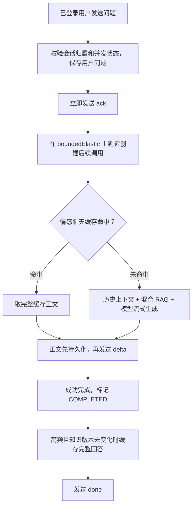

# SSE 预响应与高频问题缓存

## 检查结果

本次检查发现，`ConversationChatService.stream()` 已经发送 `ack`，但在创建模型 Publisher 之后才拼接这个事件，创建过程中的同步慢操作仍可能延后首包。旧的 `LoveApp.doChatByStreamWithPreResponse()` 虽然包含热问题缓存，却没有被当前 HTTP 聊天接口调用；旧缓存只按问题文本生成键，也没有区分用户、上下文或知识更新。

本次把预响应和缓存统一接入正在使用的会话服务，并删除了没有调用方的旧入口。原 GET 兼容路由与新 POST 聊天路由仍共用当前流程。

## 用一个例子理解

用户发送“恋爱中如何平衡学习和约会？”。服务先验证账号与会话，把用户问题保存下来，随即发送 `ack: thinking`。页面将“正在发送…”改成“已收到，正在整理回复…”。这条状态不会混入助手正文，也不会存成聊天回答。

随后查询缓存。如果同一用户、同一历史上下文、同一知识版本下的这个问题已有缓存，就直接发送缓存正文并写入当前会话；否则执行混合 RAG 检索和模型生成，边收到正文边保存、发送。

顺序请求的情况下，一个键在 1 小时内累计 3 次，到第 3 次完整回答时可以写缓存，第 4 次请求即可命中。不是在同一个会话里不断重复一句话就一定命中：前一次交流会改变历史上下文。

## 执行流程



`Flux.concat(ack, Flux.defer(...).subscribeOn(boundedElastic()))` 保证先发预响应，再创建缓存查询、检索和模型调用。这里关键的是把“创建慢调用”的代码也放进 `defer`，仅仅在已创建的模型流前拼接一个事件并不充分。

数据库归属校验和当前轮次创建仍在 `ack` 之前，保证非法会话返回 HTTP 404、并发冲突返回 409，而不会先用 HTTP 200 接受请求。鉴权、数据库和网络时间不会被预响应消除。

`AiController` 设置 `Cache-Control: no-store, no-transform` 和 `X-Accel-Buffering: no`，提示中间层不要缓存或缓冲 SSE。代理若强制覆盖这些设置，仍须在实际部署环境检查缓冲配置。

前端只把 `delta` 拼接到正文，`ack` 更新临时提示，`done/error` 更新完成状态。

## 缓存怎样保证回答适用

缓存键包含以下字段，并使用长度前缀编码后计算 SHA-256，避免拼接歧义：

```text
回答策略版本 + 用户 ID + 应用类型 + 知识库版本
+ 实际送给模型的历史消息（角色、正文、顺序）
+ 当前问题
```

问题只去掉首尾空白，保留标点、数字和大小写。例如 `1.5元` 和 `15元` 不会像旧实现那样被合并。回答缓存不使用语义相似匹配；检索阶段的关键词扩展不改变回答缓存键。

同一用户的两个新会话历史都为空，问同一句话可以复用缓存。用户不同、有效历史不同或知识版本不同，都会产生不同缓存键。这样会降低跨用户的缓存命中率，但不会把一个用户的个性化回答直接发给另一个人。如果未来需要全站共享 FAQ，可独立设计经过审核、不包含用户上下文的标准问答缓存。

`KnowledgeIndex.Snapshot` 增加版本号，每次构建候选索引生成新版本，只有成功发布快照才切换当前版本。知识增删改成功后，下一次请求不再访问旧版本回答；生成过程中发现版本已改变，也不会把旧回答写进缓存。更新前已开始的请求可能继续使用当时版本，和原来的检索快照语义一致。

缓存策略目前集中在 `HotQuestionCacheService`：

| 项目 | 默认值 / 行为 |
| --- | --- |
| 热度阈值 | 同一个完整缓存键累计 3 次 |
| 热度窗口 | 1 小时固定窗口，到期重置 |
| 回答有效期 | 写入后 30 分钟，读取不续期 |
| 最大条目数 | 1000 个，包含热度统计；按最近使用情况淘汰 |
| 单条回答上限 | 20000 字符，超长回答正常保存但不缓存 |
| 异常 / 断线 | 已收到的内容保留在会话里，部分回答不缓存 |
| 持久化失败 | 不写入回答缓存 |
| 适用范围 | LOVE 情感问答；Manus 的工具执行不使用回答缓存 |

缓存命中也经过 `store.append()` 和 `store.finish(COMPLETED)`，因此刷新或重启后仍能看到这轮对话，下一轮模型也能读到它。并发请求命中同一冷键时，暂未合并模型调用。

当前缓存驻留单进程内存，重启后重新累计热度；这不会影响数据库里的历史对话。到期项在访问时清理，容量始终有上限。多实例部署如需共享缓存，需要改用共享存储并同步知识版本。

## 怎样验证效果

必须区分三个指标：

- **首个响应体字节时间**：客户端收到第一段 body 的时间，可能只包含状态信息。
- **ack 时间**：客户端解析出“已收到”事件的时间。
- **正文首字时间**：客户端首次拿到非空 `delta` 的时间；缓存命中时它来自缓存，不是模型新生成。

预响应主要改善前两项和页面反馈；不能把它描述成模型推理变快。缓存命中跳过检索和模型，才会直接减少正文等待和模型调用。

本次后端共 55 项相关测试通过，包括：

- 人为阻塞模型 Publisher 创建，验证先发 ack。
- 临时 Tomcat 和真实本地 HTTP 客户端验证：模型仍被阻塞时，ack 已经到达网络客户端。
- 第 4 次同条件请求不调用模型，缓存正文写入当前会话并发送 done。
- 用户、历史、知识版本隔离，以及生成途中更新知识时不缓存旧答案。
- TTL、热度窗口、LRU 淘汰、空答案和超长答案。
- 失败或取消不缓存部分正文，原有会话持久化、权限、RAG 和知识库维护回归。

前端生产构建通过。测试使用模型桩，没有测量真实外部模型的性能提升比例。

运行后端测试：

```sh
mvn -o -Dtest='HotQuestionCacheServiceTest,ConversationSseCacheTest,ConversationSseTransportTest,ConversationPersistenceTest,ConversationControllerTest,ConversationSecurityStreamTest,LoveHistoryPromptTest,KnowledgeManagementTest,KnowledgeSecurityTest,LoveAppHybridDocumentRetrieverTest,LoveAppKeywordExpansionServiceTest,LoveAppRetrievalCorpusTest,LoveAppKnowledgeRecallTest,AuthServiceTest' test
```

`scripts/sse-benchmark.mjs` 已更新为当前的鉴权 POST 接口，会先创建真实会话，再发送问题，分别输出 first-body-byte、ack、first-delta 和 total。不会把状态事件计入正文长度，也会把 error 或缺少 done 的连接计为失败。

```sh
# 在环境变量 API_TOKEN 中设置当前账号的登录 token，不要把 token 提交到仓库。
# 脚本会创建测试会话；未命中时会正常调用配置的模型。
REQUESTS=4 CONCURRENCY=1 node scripts/sse-benchmark.mjs
```

默认每次使用同一账号的新会话，便于验证相同空历史上下文的缓存。从冷缓存开始，观察前三次与第四次的 first-delta 差异。开启并发会同时产生多个冷请求，不适合验证“第 4 次必命中”的顺序场景。

脚本已用本地模拟 SSE 服务校验指标区分和中文正文计数；这项校验不是实际业务性能数据。

## 关键代码

- `conversation/ConversationChatService.java`：预响应、缓存接入、持久化和终止状态。
- `cache/HotQuestionCacheService.java`：隔离键、热度统计、TTL、容量管理。
- `knowledge/KnowledgeIndex.java`：知识快照版本。
- `controller/AiController.java`：实际 SSE 路由与响应头。
- `liu-ai-agent-frontend/src/components/ConversationChat.vue`：处理 ack。
- `liu-ai-agent-frontend/src/components/ChatWindow.vue`：展示临时等待状态。
- `scripts/sse-benchmark.mjs`：按事件类型区分耗时。
